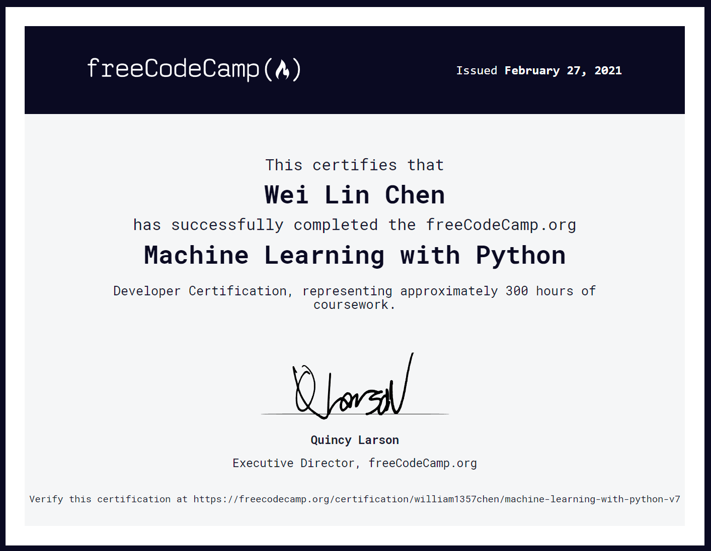

# freeCodeCamp Machine Learning with Python
These are the five projects for the Machine Learning with Python curriculum on freeCodeCamp.
 
## Project List
* [Rock Paper Scissors](fcc-rock-paper-scissors)
* [Cat and Dog Image Classifier](fcc-cat-dog)
* [Book Recommendation Engine using KNN](fcc-book-recommendation-knn)
* [Linear Regression Health Costs Calculator](fcc-predict-health-costs-with-regression)
* [Neural Network SMS Text Classifier](fcc-sms-text-classification)

## Overview
The cirruculum helped me familiarize with Python's Machine Learning and Deep Learning libraries and techniques. These libraries include:
* numpy, pandas, matplotlib, scipy
* sklearn, keras, tensorflow, nltk

I learned the specializations and applications of Machine Learning algorithms such as Regression, Classification, Computer Vision, NLP, Q-Learning, etc.
## Certification

